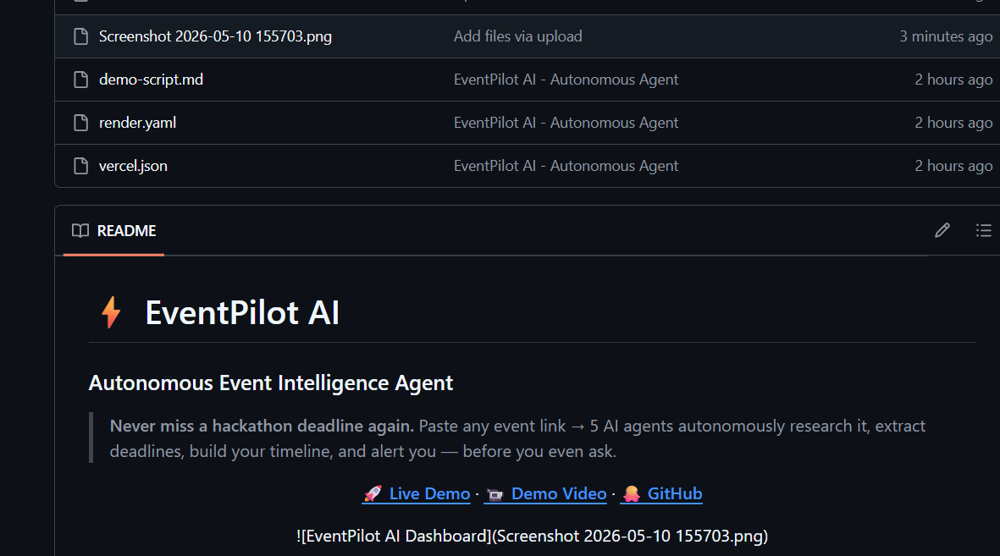

# ⚡ EventPilot AI
### Autonomous Event Intelligence Agent

> **Never miss a hackathon deadline again.**
> Paste any event link → 5 AI agents autonomously research it, extract deadlines, build your timeline, and alert you — before you even ask.

<div align="center">

**[🚀 Live Demo](https://eventpilot-ai.vercel.app)** · **[📹 Demo Video][(https://drive.google.com/file/d/1lJzg6dcAHVQjD8gogsAcr180zPMcQ4kJ/view?usp=drive_link)** · **[🐙 GitHub](https://github.com/ankita7Patil/Eventpilot-AI)**



</div>

---

## 🎯 The Problem

Students register for hackathons, internships, and competitions — then forget about them. They miss deadlines, skip mentor sessions, and lose track of updates.

**EventPilot AI solves this by acting before the user asks.**

---

## 🤖 How It Works

```
User pastes any event URL
         ↓
  ┌─────────────────┐
  │  Monitor Agent  │  → Scrapes event page (Luma, Devfolio, Unstop, any site)
  └────────┬────────┘
           ↓
  ┌─────────────────┐
  │ Research Agent  │  → Generates AI briefing via Groq LLM
  └────────┬────────┘
           ↓
  ┌──────────────────────┐
  │ Recommendation Agent │  → Ranks strategies & project ideas
  └────────┬─────────────┘
           ↓
  ┌──────────────────┐
  │ Scheduling Agent │  → Builds deadline timeline
  └────────┬─────────┘
           ↓
  ┌──────────────┐
  │  Alert Agent │  → Sends proactive reminders
  └──────────────┘
           ↓
  Dashboard + Smart Chat
```

---

## ✨ Features

| Feature | Description |
|---------|-------------|
| 🔍 Universal Scraper | Works on Luma, Devfolio, Unstop, and any event page via Jina AI |
| 🤖 5 Autonomous Agents | Run the full pipeline without user input |
| 💬 Smart Chat | Ask questions about your event in plain English |
| ⏱️ Live Countdown | Deadline clock ticks in real time, turns red when urgent |
| 🔔 Browser Alerts | Notifications before deadlines — even when tab is closed |
| 📅 Calendar Export | Download .ics file for Google/Apple Calendar |
| 🔐 User Login | Personalized session with name + email |

---

## 🏆 Sponsor Tracks

| Track | Implementation |
|-------|---------------|
| **Zynd AI / Zendia** | 5-agent autonomous network with shared event state and workflow handoffs |
| **Apify** | Universal scraper — Jina AI Reader + BeautifulSoup for any site including JS-rendered |
| **Superplane** | Sequential `monitor → research → recommendation → scheduling → alert` orchestration |
| **GitHub Copilot** | Used throughout development — agents, routes, scraper logic, README |

---

## 🛠️ Tech Stack

- **Frontend:** HTML, CSS, Vanilla JS — deployed on Vercel
- **Backend:** FastAPI (Python) — deployed on Render
- **AI:** Groq API (`llama-3.1-8b-instant`) — free, fast, no quota issues
- **Scraping:** Jina AI Reader + BeautifulSoup (3 fallback strategies)
- **Storage:** In-memory (Supabase-ready)

---

## 🚀 Try It Live

👉 **[https://eventpilot-ai.vercel.app](https://eventpilot-ai.vercel.app)**

1. Sign in with your name + email
2. Paste any event link (try `https://lu.ma/803z28jk`)
3. Click **Analyze**
4. Watch 5 agents work autonomously
5. Ask the chat anything about your event

---

## 💻 Run Locally

```bash
# Clone
git clone https://github.com/ankita7Patil/Eventpilot-AI.git
cd Eventpilot-AI

# Backend setup
cd backend
python -m venv .venv
.venv\Scripts\activate        # Windows
source .venv/bin/activate     # Mac/Linux
pip install -r requirements.txt

# Create backend/.env
echo "GROQ_API_KEY=your_key_here" > .env
echo "LLM_PROVIDER=groq" >> .env

# Start backend
uvicorn main:app --reload

# Open frontend
# Open frontend/login.html with VS Code Live Server
```

Get free Groq API key → **[console.groq.com](https://console.groq.com)**

---

## 📁 Project Structure

```
Eventpilot-AI/
├── backend/
│   ├── agents/
│   │   ├── monitor_agent.py       ← Scrapes event pages
│   │   ├── research_agent.py      ← AI briefing generation
│   │   ├── recommendation_agent.py← Strategy ranking
│   │   ├── scheduling_agent.py    ← Timeline building
│   │   └── alert_agent.py         ← Reminder creation
│   ├── services/
│   │   ├── llm_service.py         ← MCP-ready AI router (Groq/Gemini/OpenAI)
│   │   ├── scraper_service.py     ← Universal scraper with Jina AI
│   │   └── orchestrator.py        ← Superplane-style workflow
│   ├── main.py
│   └── requirements.txt
├── frontend/
│   ├── index.html                 ← Main dashboard
│   ├── login.html                 ← Sign in page
│   ├── app.js                     ← Frontend logic
│   └── styles.css
├── assets/
│   └── demo.png                   ← Dashboard screenshot
└── .env.example
```

---

## 👩‍💻 Built By

**Ankita Patil** — Solo submission for **Bot-a-thon 2025**

Powered by Aya Community × GitHub Education × Superplane × Zynd AI × Apify

---

## 📄 License

MIT
